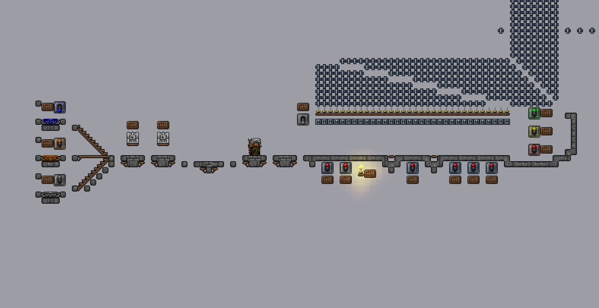
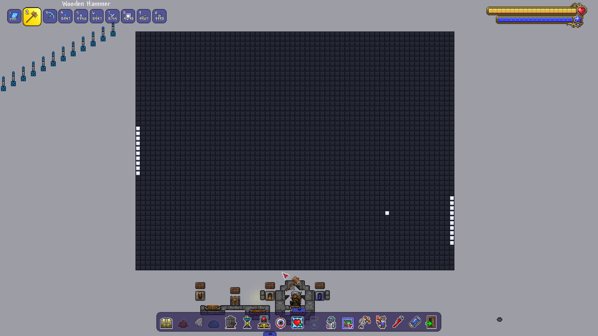

<h1 align="center">
  <picture></picture>
  <br />
  Computerraria
</h1>
<h2 align="center">
  A fully compliant RISC-V computer inside Terraria
</h2>
<h2 align="center">
  Video explanation: https://youtu.be/zXPiqk0-zDY
</h2>

<div align="center">
  <a href=https://github.com/misprit7/computerraria/actions/workflows/in-game-tests.yml>
    
  </a>
  <a href=https://github.com/misprit7/computerraria/actions/workflows/rust-tests.yml>
    
  </a>
</div>

# Pitch

There are two fundamentally competing forces when it comes to computer speed. The first, and most famous, is Moore's law, where physical transistor densities scale exponentially. The second is the inevitable growth of software bloat that runs on top of increasingly modern processors. There's a kind of equilibrium between these two competing beasts, ensuring that a user always manages to get at least a split second of mindfulness while staring at a frozen screen whenever attempting to open the latest app. 

This project is an attempt to score a decisive rout in this ongoing battle in favor of the *programmer*. By emulating a complete rv32i instruction set inside the wiring system of [Terraria](https://www.terraria.org/), we push back speeds to the early 70s era, tossing the ball firmly back into the court of the silicon engineer without losing any software functionality. 

# Overview

<div align="center">
  <a href=https://easyzoom.com/image/412333>
    
    Click to see navigable image
  </a>
</div>

Despite what the pitch may lead one to believe the goal of this project is to maximize the compliance and processing ability of the in game cpu. This is only possible with the help of an accelerator mod, which maintains full compatibility with the vanilla wiring system but reimplements it in a much more efficient manner:

[WireHead](https://github.com/misprit7/WireHead) - A wiring accelerator and headless control mod

With this installed, the current specs of the computer are as follows: 

- Clock speed: ~5kHz
- Ram: 96kb
- Instruction set: rv32i

As an example of what it can do, here is Pong, running purely on the in-game cpu (see [app/pong/src/main.rs](app/pong/src/main.rs) for implementation):

https://user-images.githubusercontent.com/33139843/229342342-de4708e1-7467-4f99-834b-3d0fb28d0858.mp4

# Setup

Note that currently only Linux is fully supported, and only parts of this have been tested on Windows. However I've left some steps for anyone who wants to try getting Windows working, in theory using wsl it should be fairly straightforward and things should be identical.

## Prerequisites

For a comprehensive list of everything that is needed to run all aspects of this project, see the [Dockerfile](docker/Dockerfile). However, to develop and run applications for the computer all you really need is a working Cargo/rustc installation, install it [here](https://www.rust-lang.org/tools/install) or through your package manager.

## Setup Process

Navigate to where you want to keep this project and clone it. Copy computer.wld to your tModLoader world path. Depending on your platform, this is:
```
Windows: Documents\My Games\Terraria\ModLoader\Worlds
Linux: ~/.local/share/Terraria/tModLoader/Worlds
```
On Linux you can automate copying back and forth like this with the `copy-world.sh` script with either the `--to` (copy to world folder) or `--from` (copy from world folder) flags.

Next, navigate to the mod sources folder and clone [WireHead](https://github.com/misprit7/WireHead):

Windows
```bash
cd "%userprofile%\Documents\My Games\Terraria\ModLoader\ModSources"
git clone https://github.com/misprit7/WireHead.git
```

Linux
```bash
cd "~/.local/share/Terraria/tModLoader/ModSources" && git clone https://github.com/misprit7/WireHead.git
```

Prepare the binary you wish to run. For example for pong compile the rust app and copy the binary to a more convenient path:

```bash
cd <path to computerraria>/app/pong
cargo rb
./copy-bin.sh /tmp/pong.txt
```

Start [tModLoader](https://store.steampowered.com/app/1281930/tModLoader/), and from the main menu go to Workshop->Develop and click on the Build button next to WireHead. For convenience I'd also recommend installing Cheat Sheet and HERO's Mod from the Download Mods section of the workshop if you haven't already. Then open the new world you copied earlier in game. In game type:
```bash
/bin write /tmp/pong.txt
```

Currently the NPCs that run the CPU clock are too far away to spawn immediately, this is a bug and should be fixed soon. As a workaround, go through the blue teleporter shown below, fly upwards a bit, come back down and go back through the same teleporter.



After this workaround is done, press the first two of the three levers on the far right to start the program. Go through the orange teleporter to arrive at the screen area. Pong should be running and is controllable by the controller beneath the screen (use HERO's Mod's camera lock to see the screen and controls at the same time).



## Docker

For advanced CI/headless usage you can use the docker image:

[Docker Image](https://hub.docker.com/r/misprit7/computerraria)

If you already have docker installed this can be pulled with

```bash
docker pull misprit7/computerraria
```

You can then start the container with

```bash
docker run -it misprit7/computerraria
```

This image already has all tooling installed so you should be able to build everything. 

# File Structure

The major relevant parts of the project are as follows:

```
.
├── app/
│   ├── tdriver/
│   └── template/
├── computer.wld
├── doc/
├── docker/
├── test/
└── tinterface/
    ├── bin/
    └── tinterface/
```

`app/`

Higher level applications to be run on the computer, not including compliance tests. Currently all in rust but could also easily be in C. 

`app/tdriver/`

Driver API for interacting cpu from rust, mostly extremely low level startup code and graphics drivers.

`app/template/`

Template for new rust projects that implements minimal tdriver

`computer.wld`

The actual world file. This is technically a binary file, but given the context of the project it acts much more like source code given that it is edited manually and compresses extremely well. This generally isn't edited in place, it's copied back and forth to the user installation with [copy-world.sh](copy-world.sh). 

`doc/`

Documentation/notes for the project

`docker/`

Files required to build docker image for CI. 

`test/`

All automated tests written for the CPU. These are mostly handled through [riscof](https://github.com/riscv-software-src/riscof). This consists of both the computerraria plugin as well as a reference plugin ([sail_cSim](test/sail_cSim/)) to compare the results to. 

`tinterface/`

Interfaces programmatically with running Terraria instance. This consists of both a python module as well as a command line wrapper to upload binaries, start execution and manipulate other fine grain controls without needing a GUI. 


